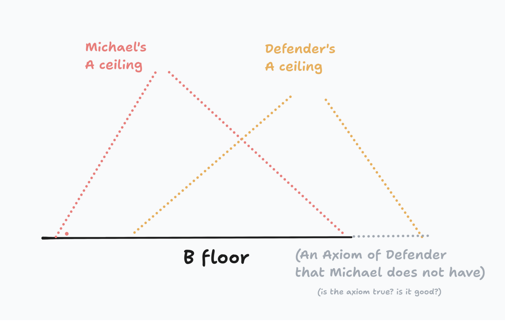
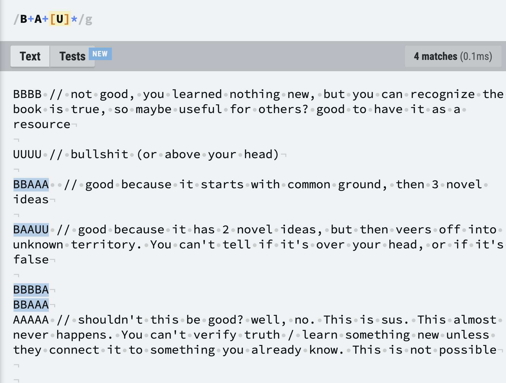

# A/B/U Review System

This is the rating system we use at ORI. Given a piece of information, rate it according to the following rubric:

> **A** - “true & useful, AND new to me”
> 
> **B** - “true & useful, but NOT novel”
> 
> **U** - “unclear, undefined, unknowable, or untrue”

Using this rating system successfully requires a minimum level of metacognition / self awareness. If the user does not meet this minimum, then using this rating system acts as a way to signal this failure.

------

This rating system is used for calibration / levelling. It cannot be faked, it cannot be gamed.

If you find someone who is capable of giving you A's, this is proof of the highest epistemic standard possible that they are "above" you, they are capable of teaching you. 

If someone is giving you U's, they may either be far below you, OR far above you. You both must adjust and try to give each other mutual B's. Once you find enough mutual B's, you can climb up from there towards your A's.

---

One way to think about A/B/U is that it's tracking updates to your world model.

> **A** - “this wasn't in my world model before, but it is now”
> 
> **B** - “this is already in my world model”
> 
> **U** - “not in my world model, but I am not going to add it” _(regardless of whether it's true or not, it has no relevance or useful predictive power to you)_

----

The "B floor" is a minimum set of beliefs / knowledge you share with someone. The "A ceiling" is your frontier. 

"Floor" and "ceiling" come from the mathematical operations like: `floor(2.7) = 2`, `ceil(2.7) = 3`. 

It is not possible to communicate any knowledge with someone with whom you share NO B floor. The wider the shared floor, the further up you can communicate. Finding someone who does NOT share exactly your floor but has still reached your ceiling (or has surpassed it) is a rare opportunity to validate a truth from a new perspective. 

----

The ideal sequence of knowledge for an ORI publication is `B+A+[U]*`. 

This is a "ladder" structure. It starts at the B floor, and works up to the frontier. You can measure someone's distance from a given frontier by how many A's they need to understand a specific point or concept. The rationalists call this [Inferential Distance](https://www.lesswrong.com/w/inferential-distance).

