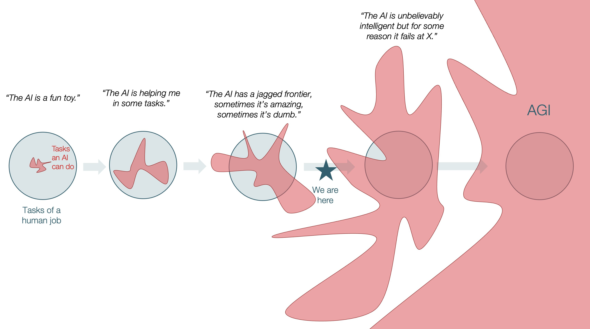
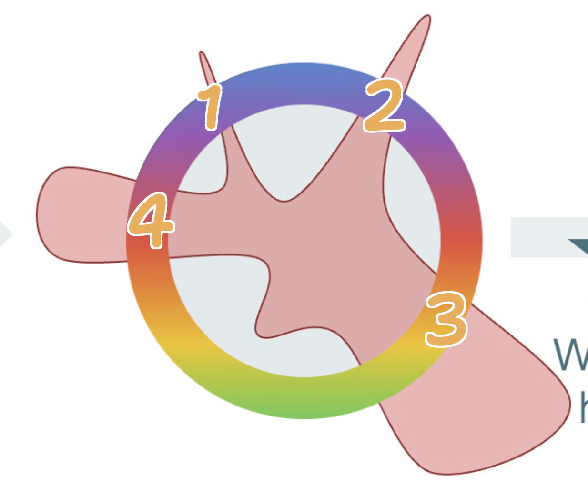
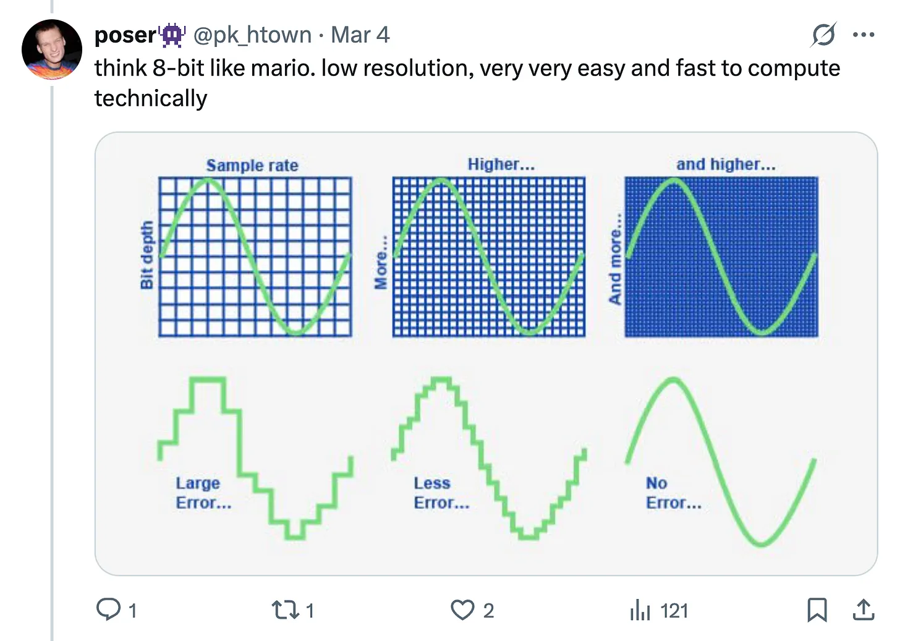
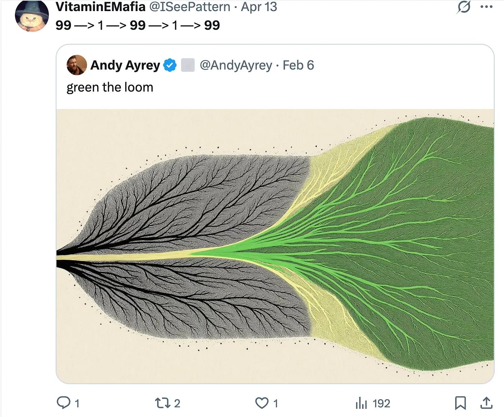
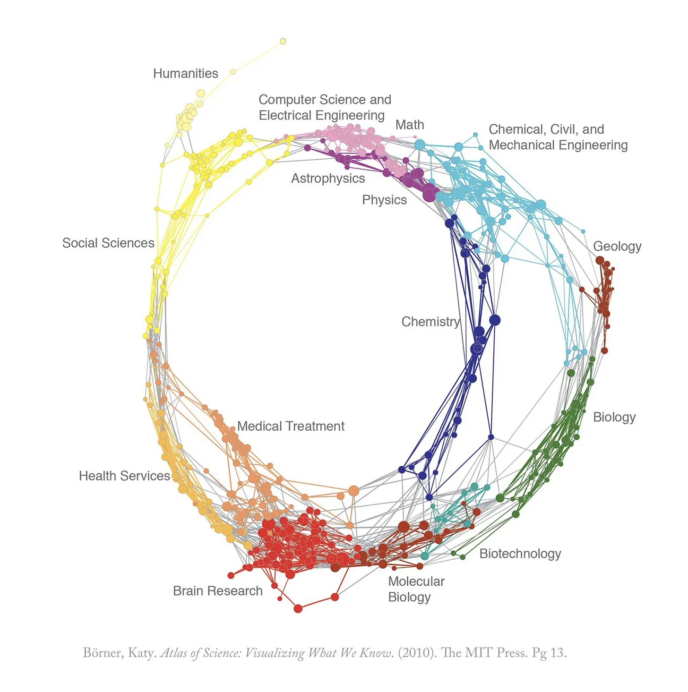
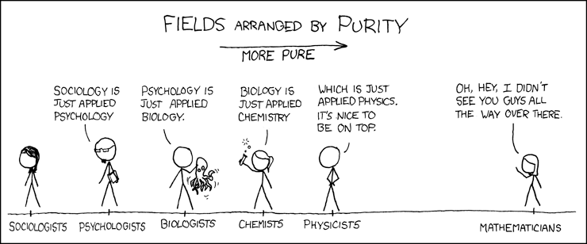

# What is the shape of the frontier of human knowledge?

You know that ["jagged frontier"](https://x.com/tomaspueyo/status/1993360931267473662/) image? 

One reason why the ORI logo is a circle is because, the way the frontier grows is ALWAYS going to be jagged (everyone furthering their "A ceiling"), specializing to go further. There is a missing step that ORI exists to serve which is the unification, and simplification. Finding invariant truths across ALL fields of inquiry (that includes science, and religion): 

---

What this "unification" looks like is something like this (thank you [@pk_htown](https://x.com/pk_htown) for this depiction):

You gather a lot of information, and make a lot of complicated models, slowly increasing your predictive power, until at some point you reach a level of abstraction where you have a MUCH simpler model and infinitely GREATER predictive power.

This is a process that repeats, and this is how the frontier grows. Otherwise you get stuck with "complexity / specialization" debt and can't grow past it.

----

_this is the part I'm least sure of / is in my "A ceiling"_

There is a "correct shape" to how all pieces of knowledge fit together. For example, in the image below, it puts math as just one field somewhere on the circle amongst all fields. But I think this is WRONG. I think the actual correct location of math would be somehow "parallel", like it's a plane inside of which all of these fields fit inside/orthogonal against? 

Math will ALWAYS be there in ALL inquiries of truth. It is not a "science" but it is present in all science. It has a relationship to reality that I think is not widely understood, but the frontier within ORI understands.  

----

If you accept the last section about there being a "correct" relationship between fields of knowledge, then I think:

- "physics" is one polar end of science, and what Michael Levin is reaching for with biology + study of platonic forms is "the other end". The laws of physics, and biology, manifest greater laws of reality
- I think all fields have a kind of "polar opposite" (I think you need to understand Sam's God Conjecture, what he says about "top down" vs "bottom up" to understand what "polar end" means)
  - AND I think "memetics" is a unique science in that its polar end IS also contained inside itself. It covers the full range, it touches the edge of "top" and "bottom". 
  - "conciousness science" (or what Ogi Ogas calls mindscience) probably has the same property, I think. 
  - Maybe also "alignment"? (the more general one, not AI alignment). I think this is why all these fields work well together. Like researchers in any of these fields see the others as their peers / can learn from each other. Like QRI (conciousness research) and memetics people will often find the same insight / same universal truth but translated in their language?